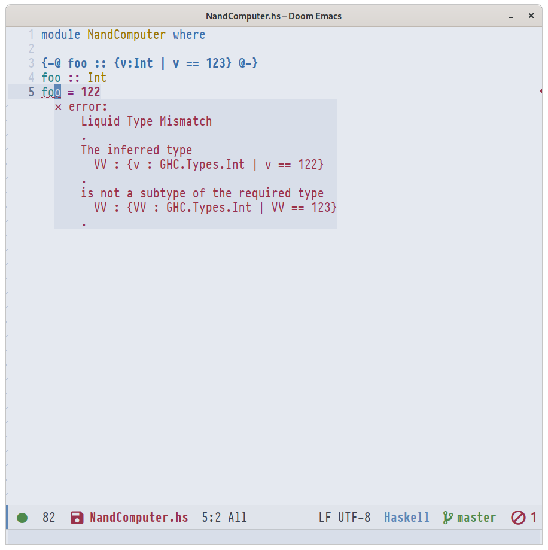

# LiquidHaskell as a GHC Plugin

This repo demonstrates how to use [LiquidHaskell](https://github.com/ucsd-progsys/liquidhaskell) as a GHC plugin.

`lh-plugin-demo.cabal` shows 

- how to tell GHC to invoke the plugin
- how to specify the relevant LH wrapper packages as dependencies

`stack.yaml` shows

- how to point `stack` at the relevant LH repositories

**TODO** `cabal.project` shows

- how to point `cabal` to the relevant LH repositories

## GHCi Integration

By virtue of being a plugin, you now get LH errors 

- when you (re)load in GHCi. 

- from all editor plugins based on `ghci` integration

### VSCode 


### Vim


### Emacs



## GHCID Integration

Additionally, [`ghcid`](https://github.com/ndmitchell/ghcid) produces LH errors on recompilation 

For `stack`-based projects, run with 

```
$ ghcid -c "stack ghci"
```

For `cabal`-based projects, run with 

```
$ ghcid -c "cabal v2-repl"
```


